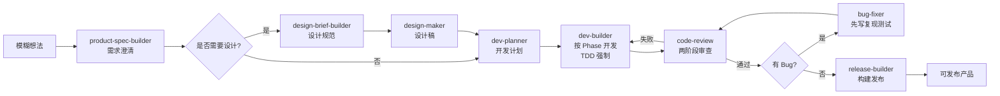

# IdeaHammer

> AI 辅助从模糊想法锤出可发布产品

一个 AI 主导的产研全流程协同框架，把产品经理的纪律（反模糊、Spec 驱动）和研发的工程化（TDD、review、release）合成一条端到端流水线。

[](LICENSE)
[](CHANGELOG.md)

---

## 它解决什么问题

做产品最大的浪费不是写代码，是**做完发现做错了**：

- 需求没想清楚就动手，做完发现用户不要
- 设计稿没敲定就开发，做完发现交互对不上
- 没有 Spec 单一真相源，代码和文档脱节
- 跳过测试直接交付，回归一次挂一片
- 没有 review 闭环，缺陷流到生产

IdeaHammer 把这些纪律**内化到 AI Agent 的执行流程里**，让人不用靠记性：

| 阶段 | 产出 | 拦截的问题 |
|------|------|----------|
| 需求收集 | Product-Spec.md | 模糊需求、自嗨假设、目标用户不清 |
| 设计规范 | Design-Brief.md | 视觉方向摇摆、复用不一致 |
| 设计图 | 设计稿 | 数值歧义、文案失真 |
| 开发计划 | DEV-PLAN.md | 依赖错乱、Phase 不可验收 |
| 项目开发 | 项目代码 | 超实现、跳过测试、回归破坏 |
| 代码审查 | 审查报告 | 功能缺失、TDD 不合规、安全漏洞 |
| Bug 修复 | 修复提交 | 表面修复、引入新缺陷 |
| 构建发布 | 发布产物 | 隐私泄漏、冒烟测试漏跑 |

---

## 和同类项目有什么不同

| 项目 | 端到端覆盖 | Spec 驱动 | 设计桥接 | TDD 强制 | 审查闭环 | 进化机制 |
|------|-----------|---------|---------|---------|---------|---------|
| **IdeaHammer** | ✅ 8 步 | ✅ | ✅ Brief + 设计稿 | ✅ 内置纪律 | ✅ 两阶段 | ✅ |
| GitHub Spec Kit | ⚠️ 3 段 | ✅ | ❌ | ❌ | ❌ | ❌ |
| 裸 Codex/Claude Code | ❌ 看 prompt | ❌ | ❌ | ❌ | ❌ | ❌ |
| 纯 vibe coding | ❌ | ❌ | ❌ | ❌ | ❌ | ❌ |

一句话：**它是 Spec Kit 往工程化推一步的版本，比 vibe coding 多纪律围栏，比传统 PRD 多 AI 执行力。**

---

## 核心流水线



每个阶段产出一个文档/产物，下一阶段按它启动。**文档是单一真相源**，任何变更先更源文档再动代码。

---

## 快速开始

### 前置条件

- [Codex CLI](https://github.com/openai/codex) 或等价 AI 编码代理
- Python 3.10+（hook 脚本依赖）
- bash / zsh

### 安装

```bash
# 1. 把仓库克隆到你的项目根目录（或本仓库直接作为脚手架使用）
git clone https://gitee.com/zhilong811/idea-hammer.git
cd idea-hammer

# 2. 把 agents/ 重命名为 .agents/（前面加一个点）
mv agents .agents

# 3. 把 codex/ 重命名为 .codex/
mv codex .codex

# 4. 启动 Codex
codex
```

> macOS 在访达里按 `Cmd+Shift+.` 可以显示隐藏文件夹。

启动后主 Agent 会读取 `AGENTS.md` 自动应用本框架。

### 第一次使用

```
> 我想做一个本地闪卡应用

[主 Agent 自动进入 product-spec-builder 阶段，追问澄清需求]
```

主 Agent 会按 8 步流水线推进：先把模糊想法问清楚 → 写 Product-Spec → 规划 → 按 Phase 开发 → 审查 → 发布。

---

## 目录结构

```
IdeaHammer/
├── README.md                  # 本文件
├── LICENSE                    # MIT 许可
├── CHANGELOG.md               # 变更日志
├── AGENTS.md                  # 主控：编排规则、Skill 调用、Sub-Agent 调度
├── 使用说明.md                # 旧版安装说明（保留兼容）
├── .agents/
│   └── skills/                # 各阶段能力模块
│       ├── product-spec-builder/   # 需求澄清 → Product-Spec.md
│       ├── design-brief-builder/   # 设计方向 → Design-Brief.md
│       ├── design-maker/           # 设计稿生成
│       ├── dev-planner/            # 分阶段计划 → DEV-PLAN.md
│       ├── dev-builder/            # 代码实现 + TDD 强制
│       ├── bug-fixer/              # 复现测试 + 根因调查
│       ├── code-review/            # 两阶段审查
│       └── release-builder/        # 打包发布
└── .codex/
    ├── hooks.json             # 事件驱动门禁配置
    ├── hooks/                 # hook 脚本本体
    ├── agents/                # code-reviewer / evolution-runner 子 Agent
    └── evolution/             # 自进化信号与建议
```

---

## 方法论

### SDD（Spec-Driven Development）

文档是开发的入口和单一真相源。代码从 Spec 生成，Spec 变则下游文档和代码同步更。

### TDD（Test-Driven Development）

**铁律：无失败测试不写生产代码。**

- RED：先写失败测试
- GREEN：写最小代码让测试通过
- REFACTOR：保持绿色前提下清理

每个 Phase 的每个 Task 强制走完整循环，bug 修复前必先写失败复现测试。详细纪律见 `agents/skills/dev-builder/SKILL.md` 和 `agents/skills/bug-fixer/SKILL.md`。

### 设计桥接

Spec 是文字，可能歧义。设计稿是图片，没有歧义但不能直接驱动代码。**Design-Brief.md 在中间做翻译**：把 Spec 的语义钉成可执行的视觉规范。

### 进化机制

你提的纠正会被抓成信号，session 启动时主 Agent 同步消化，逐条问你同意即改对应文档。框架越用越准，不是一次性写死的剧本。

---

## 设计原则

1. **文档先行**：Spec 没写清楚不进入开发，文档变则下游同步
2. **纪律内置**：把纪律写进 Skill 和 hook，不靠人记得
3. **AI 执行，人决策**：AI 是主 Agent，人在关键节点拍板
4. **阶段可验收**：每个 Phase 都可独立运行、独立验证
5. **质量闭环**：TDD + review + bug fix + release 形成完整防护栏

---

## 示例项目

| 项目 | 演示价值 |
|------|---------|
| [本地闪卡应用](./examples/flashcards) | CRUD + 学习模式，演示端到端流水线的完整跑通 |

更多示例待补。

---

## 贡献

欢迎通过 Issue / Pull Request 贡献。但请遵守以下原则：

1. 任何变更先更源文档再动代码（详见 `AGENTS.md` [总体规则]）
2. TDD 铁律不退让：所有有运行时行为的代码必先有失败测试
3. hook 抓的是确定性门禁，不是规则膨胀

详细贡献指南待补。

---

## 路线图

- [ ] v0.2：example/flashcards 跑通，发布首批真实演示
- [ ] v0.3：英文版 README
- [ ] v0.4：CI / 自动化测试
- [ ] v1.0：稳定 API，向后兼容承诺

---

## 许可

[MIT](LICENSE) © 2026 wuzhilong

---

## 致谢

本项目方法论受以下开源项目启发：

- [superpowers](https://github.com/obra/superpowers)：TDD、systematic-debugging、verification-before-completion 的核心纪律
- [GitHub Spec Kit](https://github.com/github/spec-kit)：SDD 三段式流程的早期实践
